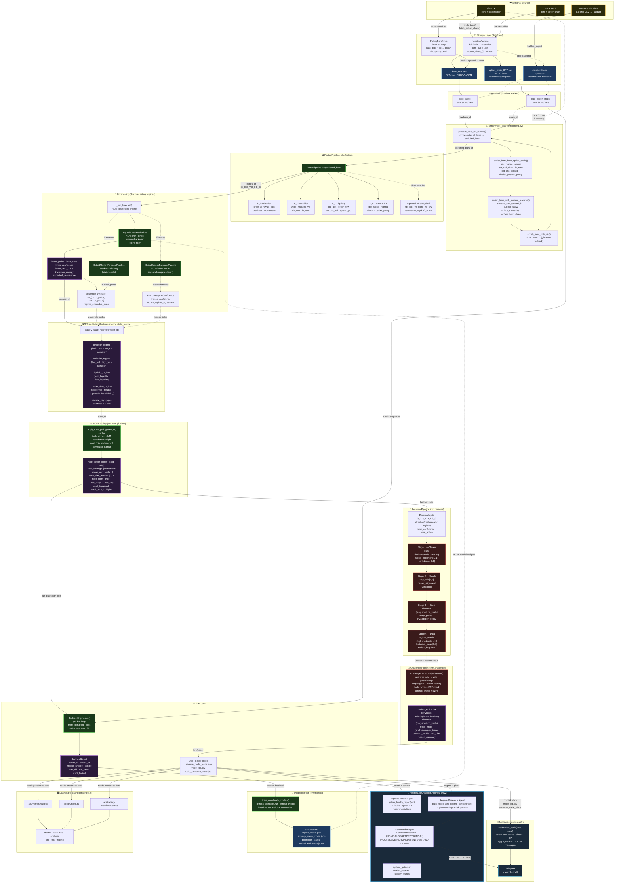

# RLM System Data Flow

```mermaid
flowchart TD

%% ─────────────────────────────────────────────
%% LAYER 0 — EXTERNAL DATA SOURCES
%% ─────────────────────────────────────────────
subgraph SRC["☁️  External Sources"]
    YF["yfinance\nbars + option chain"]
    IBKR_SRC["IBKR TWS\nbars + option chain"]
    MASSIVE["Massive Flat Files\nS3 gzip CSV → Parquet"]
end

%% ─────────────────────────────────────────────
%% LAYER 1 — INGESTION & STORAGE
%% ─────────────────────────────────────────────
subgraph STORE["💾  Storage Layer  (data/raw/)"]
    INGEST["IngestionService\nfull fetch → overwrite\nbars_{SYM}.csv\noption_chain_{SYM}.csv"]
    ROLLING["RollingBarsStore\nfetch tail only\n(last_date − 5d → today)\ndedup + append"]
    BARS_CSV["bars_SPY.csv\n502 rows, OHLCV+VWAP"]
    CHAIN_CSV["option_chain_SPY.csv\n18 720 rows\nstrike/expiry/iv/greeks"]
    PARQUET["data/raw/lake/\n*.parquet\n(optional lake backend)"]
end

YF -->|"fetch_bars()\nfetch_option_chain()"| INGEST
IBKR_SRC -->|IBKRProvider| INGEST
MASSIVE -->|flatfiles_ingest| PARQUET
INGEST --> BARS_CSV
INGEST --> CHAIN_CSV
INGEST -.->|lake backend| PARQUET

YF -->|"incremental tail"| ROLLING
ROLLING -->|"read → append → write"| BARS_CSV

%% ─────────────────────────────────────────────
%% LAYER 2 — READERS
%% ─────────────────────────────────────────────
subgraph READ["📂  Readers  (rlm.data.readers)"]
    LB["load_bars()\nauto / csv / lake"]
    LC["load_option_chain()\nauto / csv / lake"]
end

BARS_CSV --> LB
CHAIN_CSV --> LC
PARQUET -.-> LB
PARQUET -.-> LC

%% ─────────────────────────────────────────────
%% LAYER 3 — ENRICHMENT
%% ─────────────────────────────────────────────
subgraph ENRICH["🔬  Enrichment  (bars_enrichment.py)"]
    ENRICH_CHAIN["enrich_bars_from_option_chain()\ngex · vanna · charm\nput_call_skew · iv_rank\nbid_ask_spread · dealer_position_proxy"]
    ENRICH_SURF["enrich_bars_with_surface_features()\nsurface_atm_forward_iv · surface_skew\nsurface_convexity · surface_term_slope"]
    ENRICH_VIX["enrich_bars_with_vix()\n^VIX · ^VVIX  (yfinance fallback)"]
    PREP["prepare_bars_for_factors()\norchestrates all three → enriched_bars"]
end

LB -->|"raw bars_df"| PREP
LC -->|"chain_df"| PREP
PREP --> ENRICH_CHAIN --> ENRICH_SURF --> ENRICH_VIX --> PREP
YF -.->|"^VIX / ^VVIX\nif missing"| ENRICH_VIX

%% ─────────────────────────────────────────────
%% LAYER 4 — FACTOR PIPELINE
%% ─────────────────────────────────────────────
subgraph FACTORS["📊  Factor Pipeline  (rlm.factors)"]
    FP["FactorPipeline.run(enriched_bars)"]
    SD["S_D  Direction\nprice_vs_vwap · adx\nbreakout · momentum"]
    SV["S_V  Volatility\nATR · realized_vol\nvix_corr · iv_rank"]
    SL["S_L  Liquidity\nbid_ask · order_flow\noptions_vol · spread_pct"]
    SG["S_G  Dealer GEX\ngex_signal · vanna\ncharm · dealer_proxy"]
    VP_OPT["Optional VP / Wyckoff\nvp_poc · va_high · va_low\ncumulative_wyckoff_score"]
end

PREP -->|"enriched_bars_df"| FP
FP --> SD & SV & SL & SG
FP -.->|"if VP enabled"| VP_OPT

%% ─────────────────────────────────────────────
%% LAYER 5 — FORECAST / REGIME MODELS
%% ─────────────────────────────────────────────
subgraph FORECAST["🧠  Forecasting  (rlm.forecasting.engines)"]
    FE["_run_forecast()\nroute to selected engine"]
    HMM_E["HybridForecastPipeline\nRLMHMM · EM fit\nforward-backward\nonline filter"]
    MKV_E["HybridMarkovForecastPipeline\nMarkov-switching\n(statsmodels)"]
    KRO_E["HybridKronosForecastPipeline\nFoundation model\n(optional, requires torch)"]
    HMM_OUT["hmm_probs · hmm_state\nhmm_confidence\nhmm_next_probs\ntransition_entropy\nexpected_persistence"]
    ENS["Ensemble annotate()\navg(hmm_probs, markov_probs)\nregime_ensemble_state"]
    KRON_CONF["KronosRegimeConfidence\nkronos_confidence\nkronos_regime_agreement"]
end

FP -->|"factors_df\n[S_D S_V S_L S_G]"| FE
FE --> HMM_E --> HMM_OUT
FE -.->|"if markov"| MKV_E
FE -.->|"if kronos"| KRO_E
HMM_OUT --> ENS
MKV_E -.->|markov_probs| ENS
KRO_E -.->|"kronos forecast"| KRON_CONF

%% ─────────────────────────────────────────────
%% LAYER 6 — STATE MATRIX CLASSIFICATION
%% ─────────────────────────────────────────────
subgraph STATE["🗺️  State Matrix  (features.scoring.state_matrix)"]
    CSM["classify_state_matrix(forecast_df)"]
    REGIME_LABELS["direction_regime\n{bull · bear · range · transition}\n\nvolatility_regime\n{low_vol · high_vol · transition}\n\nliquidity_regime\n{high_liquidity · low_liquidity}\n\ndealer_flow_regime\n{supportive · neutral · opposed · destabilizing}\n\nregime_key  (pipe-delimited 4-tuple)"]
end

HMM_OUT -->|"forecast_df"| CSM
ENS -.->|"ensemble probs"| CSM
KRON_CONF -.->|"kronos fields"| CSM
CSM --> REGIME_LABELS

%% ─────────────────────────────────────────────
%% LAYER 7 — ROEE POLICY ENGINE
%% ─────────────────────────────────────────────
subgraph ROEE["⚖️  ROEE Policy  (rlm.roee.pipeline)"]
    ROEE_FN["apply_roee_policy(state_df, config)\nKelly sizing · HMM confidence weight\nvault / circuit-breaker / correlation haircut"]
    POLICY_OUT["roee_action  {enter · hold · skip}\nroee_strategy  {momentum · mean_rev · scalp…}\nroee_size_fraction  [0, 1]\nroee_entry_price · roee_target · roee_stop\nvault_triggered · vault_size_multiplier"]
end

REGIME_LABELS -->|"state_df"| ROEE_FN
ROEE_FN --> POLICY_OUT

%% ─────────────────────────────────────────────
%% LAYER 8 — INTERPRETATION: PERSONA
%% ─────────────────────────────────────────────
subgraph PERSONA["🖖  Persona Pipeline  (rlm.persona)"]
    P_INPUT["PersonaInputs\nS_D S_V S_L S_G\ndirection/vol/liq/dealer regimes\nhmm_confidence · roee_action"]
    SEVEN["Stage 1 — Seven\nbias {bullish·bearish·neutral}\nsignal_alignment [0,1]\nconfidence [0,1]"]
    GARAK["Stage 2 — Garak\ntrap_risk [0,1]\ndealer_alignment\nveto: bool"]
    SISKO["Stage 3 — Sisko\ndirective {long·short·no_trade}\nentry_policy · invalidation_policy"]
    DATA_STG["Stage 4 — Data\nregime_match {high·moderate·low}\nhistorical_edge [0,1]\nreview_flag: bool"]
end

POLICY_OUT -->|"last bar state"| P_INPUT
P_INPUT --> SEVEN --> GARAK --> SISKO --> DATA_STG

%% ─────────────────────────────────────────────
%% LAYER 9 — TRADE GATING: CHALLENGE
%% ─────────────────────────────────────────────
subgraph CHALLENGE["🎯  Challenge Pipeline  (rlm.challenge)"]
    CHALLENGE_PIPE["ChallengeDecisionPipeline.run()\nuniverse gate → veto passthrough\nsniper gate → setup scoring\ntrade mode + PDT check\ncontract profile + sizing"]
    CH_OUT["ChallengeDirective\nconviction {elite·high·medium·low}\ndirective {long·short·no_trade}\ntrade_mode {scalp·swing·no_trade}\ncontract_profile · risk_plan\nreason_summary"]
end

DATA_STG -->|"PersonaPipelineResult"| CHALLENGE_PIPE
CHALLENGE_PIPE --> CH_OUT

%% ─────────────────────────────────────────────
%% LAYER 10 — EXECUTION FORK
%% ─────────────────────────────────────────────
subgraph EXEC["🚀  Execution"]
    BACKTEST["BacktestEngine.run()\nper-bar loop\nmark-to-market · exits\nstrike selection · fill"]
    BT_OUT["BacktestResult\nequity_df · trades_df\nmetrics {sharpe · sortino\nmax_dd · win_rate · profit_factor}"]
    LIVE["Live / Paper Trade\nuniverse_trade_plans.json\ntrade_log.csv\nequity_positions_state.json"]
end

CH_OUT -->|"live/paper"| LIVE
POLICY_OUT -->|"run_backtest=True"| BACKTEST
LC -->|"chain snapshots"| BACKTEST
BACKTEST --> BT_OUT

%% ─────────────────────────────────────────────
%% LAYER 11 — MONITORING & NOTIFICATIONS
%% ─────────────────────────────────────────────
subgraph NOTIFY["📱  Notifications  (rlm.notify)"]
    NOTIF["notification_cycle(root, state)\ndetect new opens · closes · TP\naggregate P&L · format messages"]
    TG["Telegram\n(crew channel)"]
end

LIVE -->|"on-disk state\ntrade_log.csv\nuniverse_trade_plans"| NOTIF
NOTIF --> TG

%% ─────────────────────────────────────────────
%% LAYER 12 — AI CREW  (Hermes)
%% ─────────────────────────────────────────────
subgraph CREW["🤖  Hermes AI Crew  (rlm.hermes_crew)"]
    HEALTH_AGT["Pipeline Health Agent\ngather_health_report(root)\n→ broken systems + recommendations"]
    RESEARCH_AGT["Regime Research Agent\nbuild_trade_and_regime_context(root)\n→ plan rankings + risk posture"]
    CMD_AGT["Commander Agent\n→ CommandDecision\n{NOMINAL/DEGRADED/CRITICAL}\n{AGGRESSIVE/NORMAL/DEFENSIVE/STAND-DOWN}"]
    GATE["system_gate.json\nmarket_posture · system_status"]
end

LIVE -->|"health + context"| HEALTH_AGT
LIVE -->|"regime + plans"| RESEARCH_AGT
HEALTH_AGT --> CMD_AGT
RESEARCH_AGT --> CMD_AGT
CMD_AGT --> GATE
CMD_AGT -->|"CRITICAL → ALERT"| TG

%% ─────────────────────────────────────────────
%% LAYER 13 — MODEL REFRESH
%% ─────────────────────────────────────────────
subgraph REFRESH["🔄  Model Refresh  (rlm.training)"]
    RETRAIN["train_coordinate_models()\nrefresh_controller.run_refresh_cycle()\nbaseline vs candidate comparison"]
    ARTIFACTS["data/models/\nregime_model.json\nstrategy_value_model.json\npromotion_status: active/candidate/rejected"]
end

BT_OUT -->|"metrics feedback"| RETRAIN
RETRAIN --> ARTIFACTS
ARTIFACTS -.->|"active model weights"| HMM_E

%% ─────────────────────────────────────────────
%% LAYER 14 — DASHBOARD
%% ─────────────────────────────────────────────
subgraph DASH["🖥️  Dashboard  (dashboard/ Next.js)"]
    API_METRICS["api/metrics/route.ts"]
    API_PNL["api/pnl/route.ts"]
    API_TRADE["api/trading-overview/route.ts"]
    UI_PAGES["matrix · state-map · analysis\npnl · risk · trading"]
end

LIVE -->|"reads processed data"| API_METRICS & API_PNL & API_TRADE
API_METRICS & API_PNL & API_TRADE --> UI_PAGES

%% ─────────────────────────────────────────────
%% STYLES
%% ─────────────────────────────────────────────
classDef storage fill:#1e3a5f,stroke:#4a9eff,color:#fff
classDef compute fill:#1a3a1a,stroke:#4aff4a,color:#fff
classDef decision fill:#3a1a1a,stroke:#ff4a4a,color:#fff
classDef output fill:#2a1a3a,stroke:#aa4aff,color:#fff
classDef external fill:#2a2a0a,stroke:#ffaa00,color:#fff
classDef notification fill:#1a2a3a,stroke:#00aaff,color:#fff

class BARS_CSV,CHAIN_CSV,PARQUET,ARTIFACTS storage
class FP,HMM_E,MKV_E,KRO_E,ROEE_FN,BACKTEST,RETRAIN compute
class SEVEN,GARAK,SISKO,DATA_STG,CHALLENGE_PIPE decision
class POLICY_OUT,HMM_OUT,REGIME_LABELS,BT_OUT,CH_OUT output
class YF,IBKR_SRC,MASSIVE external
class NOTIF,TG,CREW notification
```
